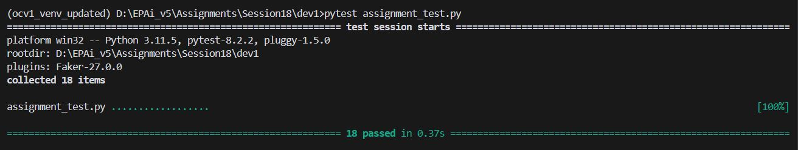
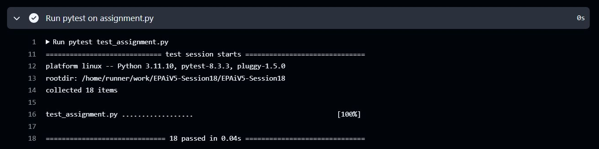

# EPAiV5-Session18 - Custom JSON Serialization and Deserialization

This README provides an overview of the custom serialization and deserialization functionality for the `Stock` and `Trade` classes in Python. We have implemented two techniques for serializing and deserializing these classes: one using a custom `JSONEncoder` and `JSONDecoder`, and another using the `Marshmallow` library, a popular library for object serialization/deserialization and schema validation.

## 1. Overview of Classes (Stock and Trade)
The program defines two classes representing financial data:

**1. Stock:** Represents daily stock market data.

- Attributes:
    - symbol (str): Stock symbol.
    - date (date): Date of the stock data.
    - open, high, low, close (Decimal): Prices for opening, highest, lowest, and closing.
    - volume (int): Volume of stocks traded.

**2. Trade:** Represents an individual trade transaction.

- Attributes:
    - symbol (str): Stock symbol for the trade.
    - timestamp (datetime): Date and time of the trade.
    - order (str): Type of order ("buy" or "sell").
    - price (Decimal): Trade price.
    - volume (int): Number of shares traded.
    - commission (Decimal): Commission charged.

## 2. Custom JSON Serialization and Deserialization

#### Custom JSONEncoder: `CustomEncoder`
The `CustomEncoder` class inherits from `json.JSONEncoder` to handle serialization of custom classes (`Stock` and `Trade`), along with built-in types like `date`, `datetime`, and `Decimal`.

**Structure of Encoded JSON:**

- Each serialized object includes a `__type__` field to indicate whether it is a `Stock` or `Trade` object, allowing us to identify the type during deserialization.
-The JSON format of each class includes only its attributes in a dictionary format.

**Implementation:**

`default(self, obj)`: Checks the type of the object (`Stock`, `Trade`, or basic data types) and returns a dictionary representation with a `__type__` key for identification.

#### Custom Decoder: `custom_decoder`
The `custom_decoder` function is a custom JSON decoder function to convert JSON objects back into `Stock` or `Trade` instances:

**Identification of Object Type:**
- The `__type__` key is read from each dictionary to determine the class (either `Stock` or `Trade`).
- Relevant data fields are used to reconstruct an instance of the identified class.

## 3. Serialization and Deserialization with Marshmallow
The `Marshmallow` library provides an alternate approach to serialization and deserialization, supporting schema validation and transformation:

#### Marshmallow Schemas
Two schemas are defined to manage serialization and deserialization of the classes:

- **StockSchema:**

    - Contains fields for each `Stock` attribute (with the `open` field mapped to `open_` to match the class attribute).
    - Uses the `@post_load` decorator to return a `Stock` instance from the deserialized data.

- **TradeSchema:**

    - Defines each attribute of the `Trade` class.
    - Uses `@post_load` to instantiate a `Trade` object from the deserialized data.

#### Marshmallow Serialization/Deserialization Functions

- **Serialization:**

    - `serialize_with_marshmallow(obj)`: Checks the type of the object and uses the appropriate schema to serialize the object to JSON format.

- **Deserialization:**

    - `deserialize_with_marshmallow(json_str, schema)`: Uses the appropriate schema to parse JSON and load it as a class instance.

## 4. Testing with `test_assignment.py`
The `test_assignment.py` file includes 18 test cases to verify correct serialization and deserialization of `Stock` and `Trade` objects. It tests:

- Custom JSON serialization and deserialization
- Marshmallow serialization and deserialization
- Ensures that the deserialized objects match the original instances in attributes and data types.

## 5. Requirements and Installation

**Requirements:**
- Python 3.x
- `marshmallow` library (for schema-based serialization/deserialization)

**Installation:**
To install the `marshmallow` library, run:

```
pip install -r requirements.txt
```

## 6. Example Usage

#### Custom JSON Serialization and Deserialization


```
import json
from datetime import date, datetime
from decimal import Decimal

# Create instances
stock = Stock("AAPL", date(2023, 11, 13), Decimal('150.0'), Decimal('155.0'), Decimal('149.0'), Decimal('152.0'), 100000)
trade = Trade("AAPL", datetime(2023, 11, 13, 10, 0), "buy", Decimal('150.5'), 500, Decimal('1.5'))

# Serialize
serialized_stock = json.dumps(stock, cls=CustomEncoder)
serialized_trade = json.dumps(trade, cls=CustomEncoder)

# Deserialize
deserialized_stock = json.loads(serialized_stock, object_hook=custom_decoder)
deserialized_trade = json.loads(serialized_trade, object_hook=custom_decoder)

print(deserialized_stock, deserialized_trade)

```

#### Marshmallow Serialization and Deserialization


```
# Using Marshmallow to serialize
serialized_stock = serialize_with_marshmallow(stock)
serialized_trade = serialize_with_marshmallow(trade)

# Using Marshmallow to deserialize
deserialized_stock = deserialize_with_marshmallow(serialized_stock, StockSchema())
deserialized_trade = deserialize_with_marshmallow(serialized_trade, TradeSchema())

print(deserialized_stock, deserialized_trade)

```

## Test Results

### Local PC Execution




### Workflow Actions



## Conclusion
This implementation demonstrates two methods for serializing and deserializing custom Python objects. By combining custom `JSONEncoder` and `JSONDecoder` classes and `Marshmallow` schemas, we create a robust solution for handling complex data types, making it easier to store and retrieve data accurately. This dual approach provides flexibility and efficiency, ensuring compatibility with JSON and schema-based serialization requirements.


---------------------------------------------------------------------------------------------------------------------------------------------------

**Submission by** - Hema Aparna M

**mail id** - mhema.aprai@gmail.com

---------------------------------------------------------------------------------------------------------------------------------------------------
